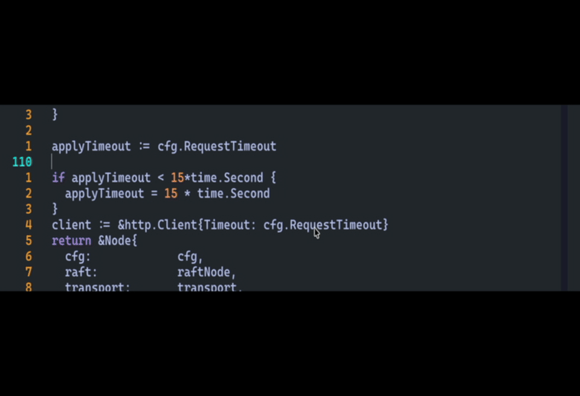

# codex-nvim

Neovim integration for the `codex` CLI. It sends the current selection or buffer
to Codex and replaces it with the returned output.
Modular Lua architecture; see `ARCHITECTURE.md` for module layout.

## Demo


## Requirements
- `codex` 0.45.0+ available on your `$PATH`
- Neovim 0.8+

## Install (lazy.nvim)
```lua
{
  "momiforgotthesemicolon/codex-nvim",
  config = function()
    require("codex").setup()
    vim.keymap.set({ "n", "x" }, "<leader>i", function()
      require("codex").completeSelectionOrScope()
    end, { desc = "Codex: complete selection or buffer" })
    vim.keymap.set("n", "<leader><leader>i", function()
      require("codex").openLastLog()
    end, { desc = "Codex: open last log" })
  end,
}
```

## Commands
- `:CodexComplete` - complete the current selection or the full buffer.
- `:CodexCompleteBuffer` - always run against the full buffer.
- `:CodexOpenLog` - open the most recent Codex log.

## Configuration
```lua
require("codex").setup({
  status_hl = "CodexStatus",
  status_interval_ms = 200,
})
```
Settings:
- `status_hl` - highlight group used for the inline status line while Codex runs.
- `status_interval_ms` - how often (ms) the status line updates.

You can also override these via globals:
- `vim.g.codex_status_hl`
- `vim.g.codex_status_interval_ms`

## Architecture
See `ARCHITECTURE.md` for module responsibilities and layout.
